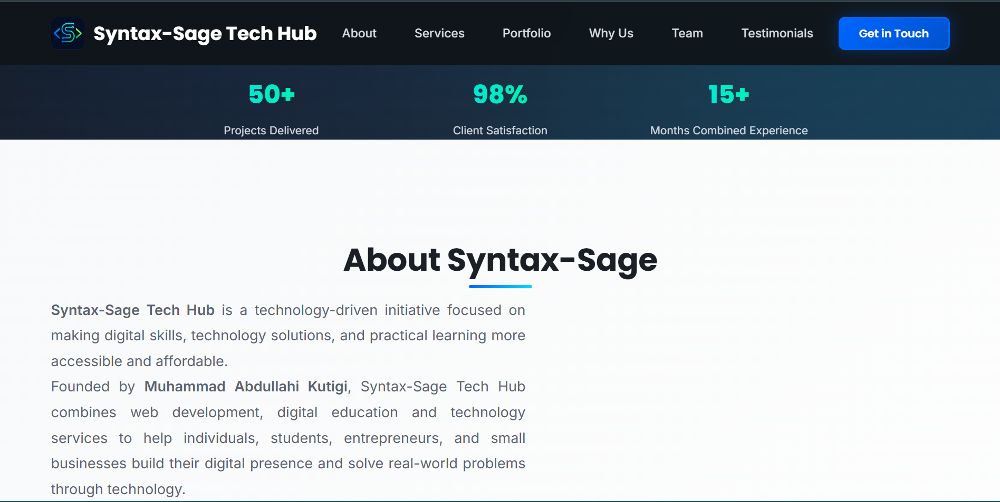
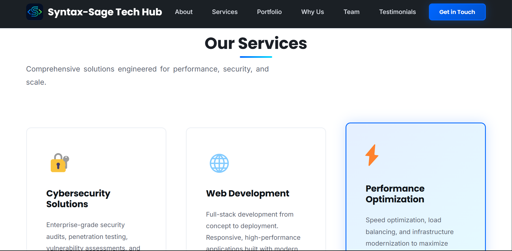
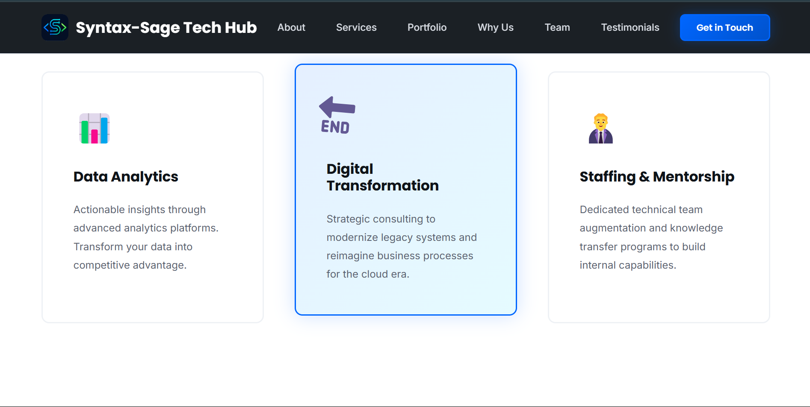
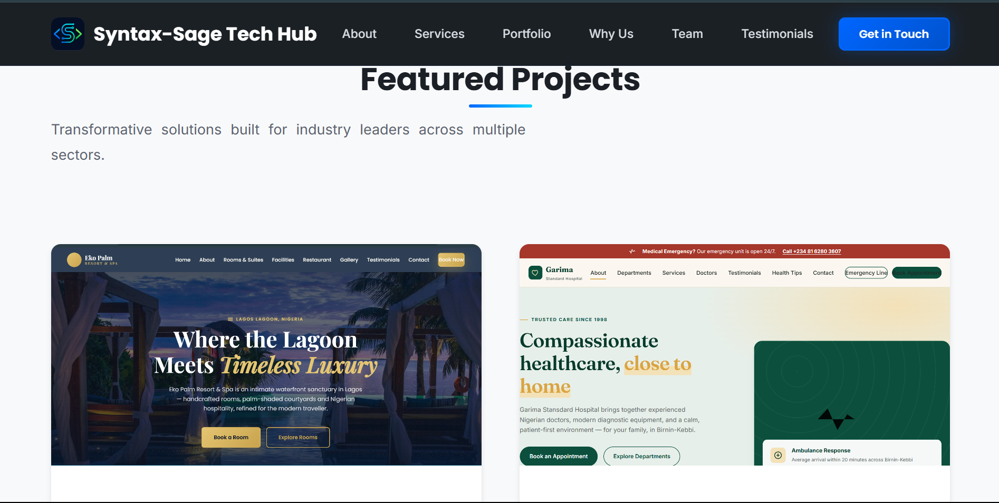

# Syntax-Sage Tech Hub

A modern technology services website designed to showcase digital solutions, web development services, and technology projects.

## 🚀 Live Website

https://syntax-sage-tech-hub.netlify.app/

## 📸 Screenshots

### Homepage





### Services




### Projects




## Leadership


## 📌 About the Project

Syntax-Sage Tech Hub is a responsive technology-focused website created to present professional technology services and digital solutions through a clean and modern web interface.

The project focuses on responsive design, usability, performance, and clear presentation of technology services.

## ✨ Features

- Responsive website design
- Mobile-friendly layout
- Professional navigation
- Technology service showcase
- Project/portfolio showcase
- Responsive images and media
- SEO configuration
- Sitemap integration
- Robots.txt configuration
- Google Search Console verification
- Clean and structured HTML/CSS

## 🛠️ Technologies

- HTML5
- CSS3
- Responsive Web Design
- Git
- GitHub
- Netlify

## 📂 Project Structure

```text
Syntax-Sage-Website/
│
├── index.html
├── styles.css
├── jpg_png-files/
├── robots.txt
├── sitemap.xml
├── google verification file
└── README.md
